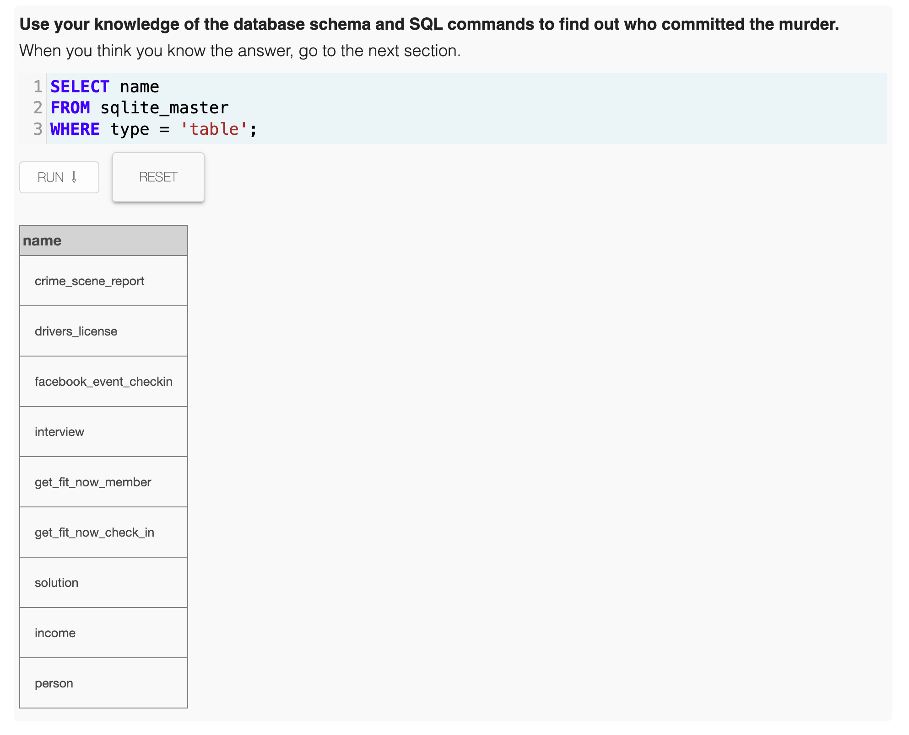
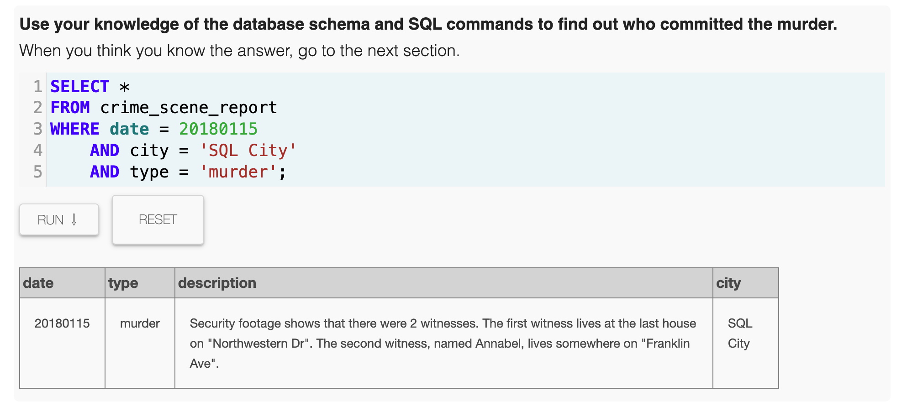
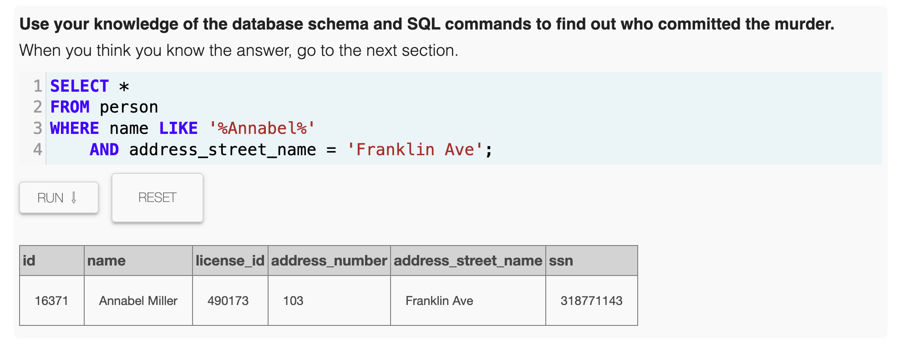
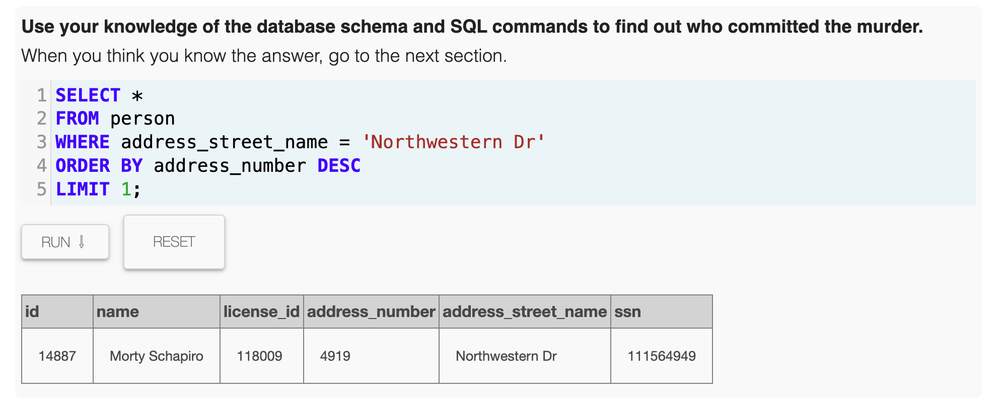
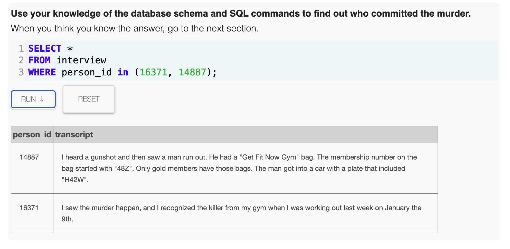
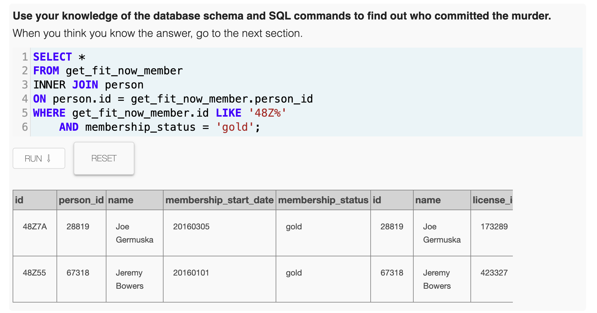
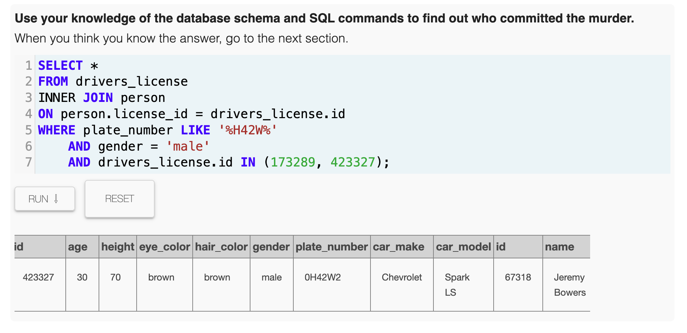
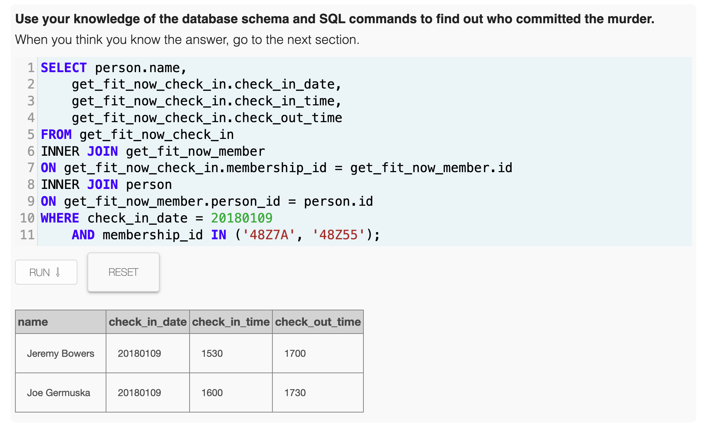
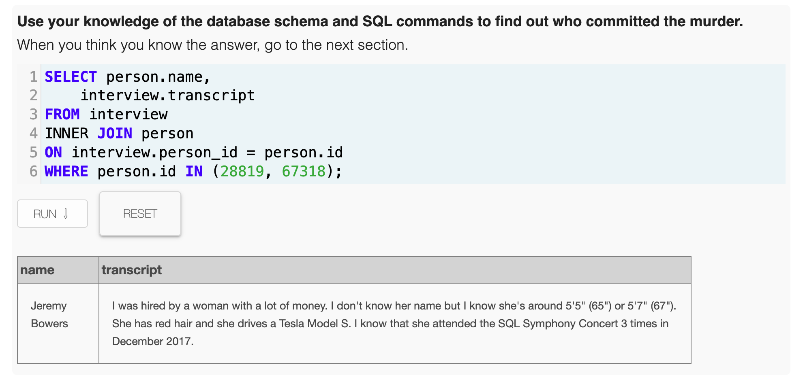
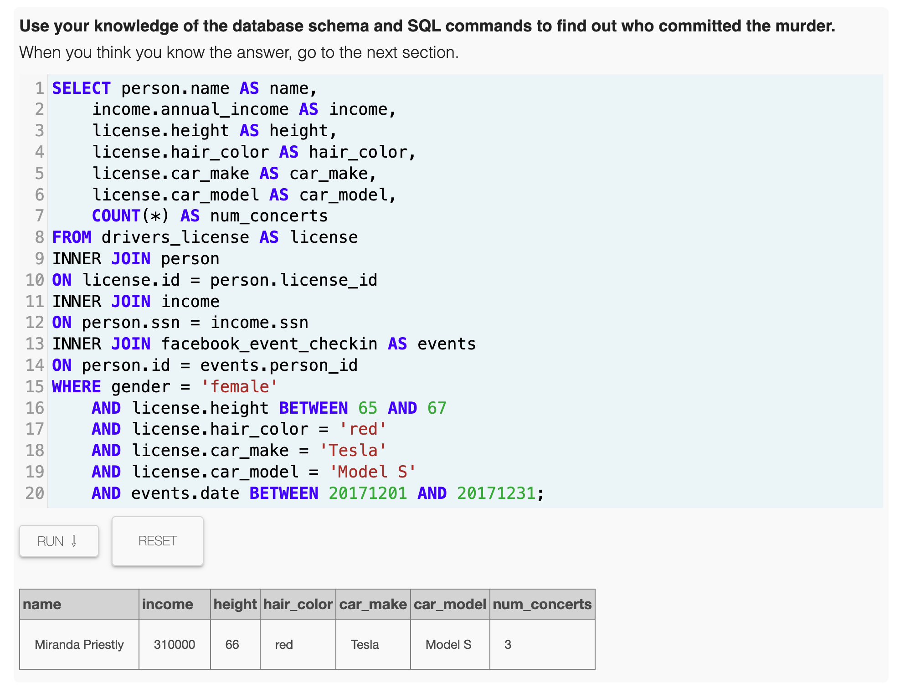

# Reporte de Investigación: SQL Murder Mystery

**Detective:** Mateo Upegui  
**Actividad:** Laboratorio 2 - Introducción a SQL y Documentación en GitHub

---

## 1. Resumen del Caso

Tras una exhaustiva investigación en las bases de datos de **SQL City**, se ha resuelto el asesinato ocurrido el **15 de enero de 2018**. El autor material del crimen fue **Jeremy Bowers**, quien fue identificado gracias a su membresía en el gimnasio "Get Fit Now Gym" y su vehículo registrado. 

Sin embargo, Bowers no actuó por cuenta propia. En su declaración, confesó haber sido contratado por una mujer de alta capacidad económica. La autora intelectual fue identificada como **Miranda Priestly**, una mujer de cabello rojo y estatura promedio, quien asistió a múltiples conciertos de la sinfonía de SQL en diciembre de 2017 y conduce un Tesla Model S.

---

## 2. Bitácora de Investigación

### Paso 1: Consulta de las tablas disponibles
Para entender con qué datos contaba, listé todas las tablas de la base de datos.
```sql
SELECT name FROM sqlite_master WHERE type = 'table';
```
> 

### Paso 2: Análisis de la escena del crimen
Busqué el reporte oficial del asesinato ocurrido el 15 de enero de 2018 en SQL City.
```sql
SELECT * FROM crime_scene_report 
WHERE date = 20180115 AND city = 'SQL City' AND type = 'murder';
```
> **Hallazgo:** El reporte indica que hubo dos testigos. El primero vive en la última casa de la calle "Northwestern Dr". El segundo se llama "Annabel" y vive en "Franklin Ave".
> 

### Paso 3: Identificación de los testigos
Localicé a los dos testigos en la tabla `person` para obtener sus IDs y poder revisar sus testimonios.
```sql
-- Testigo 2: Annabel Miller
SELECT * FROM person WHERE name LIKE '%Annabel%' AND address_street_name = 'Franklin Ave';

-- Testigo 1: Morty Schapiro (última casa de Northwestern Dr)
SELECT * FROM person WHERE address_street_name = 'Northwestern Dr' ORDER BY address_number DESC LIMIT 1;
```
> 
> 

### Paso 4: Revisión de las entrevistas
Consulté las declaraciones de Morty (ID 14887) y Annabel (ID 16371).
```sql
SELECT * FROM interview WHERE person_id in (16371, 14887);
```
> **Hallazgo:** Morty vio a un hombre con un bolso del gimnasio "Get Fit Now" (ID iniciando en "48Z", estatus Gold) escapando en un auto con placa "H42W". Annabel reconoció al asesino de su gimnasio, donde entrenó el 9 de enero.
> 

### Paso 5: Filtrado de sospechosos (Gimnasio)
Busqué a los miembros del gimnasio que coincidieran con la descripción de Morty.
```sql
SELECT * FROM get_fit_now_member
INNER JOIN person ON person.id = get_fit_now_member.person_id
WHERE get_fit_now_member.id LIKE '48Z%' AND membership_status = 'gold';
```
> **Hallazgo:** Identifiqué a dos sospechosos: Joe Germuska y Jeremy Bowers.
> 

### Paso 6: Cruce con licencias de conducir
Filtré las licencias de conducir para encontrar quién tenía la placa que contenía "H42W".
```sql
SELECT * FROM drivers_license
INNER JOIN person ON person.license_id = drivers_license.id
WHERE plate_number LIKE '%H42W%' AND gender = 'male' AND drivers_license.id IN (173289, 423327);
```
> **Hallazgo:** El sospechoso principal es **Jeremy Bowers**, conductor de un Chevrolet Spark LS.
> 

### Paso 7: Confirmación de coartada
Verifiqué si Jeremy Bowers estuvo en el gimnasio el 9 de enero como indicó Annabel.
```sql
SELECT person.name, get_fit_now_check_in.check_in_date
FROM get_fit_now_check_in
INNER JOIN get_fit_now_member ON get_fit_now_check_in.membership_id = get_fit_now_member.id
INNER JOIN person ON get_fit_now_member.person_id = person.id
WHERE check_in_date = 20180109 AND membership_id IN ('48Z7A', '48Z55');
```
> 

### Paso 8: Interrogatorio al asesino
Revisé la entrevista de Jeremy Bowers para encontrar al autor intelectual.
```sql
SELECT person.name, interview.transcript FROM interview
INNER JOIN person ON interview.person_id = person.id
WHERE person.id = 67318;
```
> **Hallazgo:** Jeremy confesó haber sido contratado por una mujer millonaria, con cabello rojo, de 65-67 pulgadas de estatura, que conduce un Tesla Model S y asistió al concierto sinfónico 3 veces en diciembre de 2017.
> 

### Paso 9: Hallazgo de la autora intelectual
Crucé los datos de ingresos, características físicas, vehículos y eventos para encontrar a la responsable.
```sql
SELECT person.name, income.annual_income, license.height, license.hair_color, license.car_make, license.car_model, COUNT(*) AS num_concerts
FROM drivers_license AS license
INNER JOIN person ON license.id = person.license_id
INNER JOIN income ON person.ssn = income.ssn
INNER JOIN facebook_event_checkin AS events ON person.id = events.person_id
WHERE gender = 'female' AND license.height BETWEEN 65 AND 67 AND license.hair_color = 'red' 
AND license.car_make = 'Tesla' AND license.car_model = 'Model S' AND events.date BETWEEN 20171201 AND 20171231;
```
> **Resultado Final:** La autora intelectual es **Miranda Priestly**.
> 

---

## 3. Conclusión
El caso se resolvió satisfactoriamente vinculando pruebas físicas (bolso del gimnasio, placas), testimonios oculares y registros financieros/sociales. El uso de JOINs complejos permitió filtrar una vasta cantidad de datos hasta llegar a la cúspide de la conspiración.
